# 🏋️ Centro Fluid App

Aplicación móvil desarrollada como proyecto final del Grado Superior de Desarrollo de Aplicaciones Multiplataforma (DAM).

Esta app ha sido creada específicamente para **Centro Fluid**, un centro de entrenamiento personal ubicado en Churriana de la Vega (Granada), con el objetivo de digitalizar y optimizar la gestión de entrenamientos, reservas y clientes.

---

## 📱 Descripción

Centro Fluid App permite gestionar de forma eficiente las sesiones de entrenamiento tanto para **clientes** como para **entrenadores**.

### 👤 Clientes pueden:
- Reservar clases de entrenamiento
- Cancelar reservas
- Consultar historial de clases realizadas
- Gestionar su perfil

### 🧑‍🏫 Entrenadores pueden:
- Crear, editar y eliminar ejercicios
- Crear sesiones de entrenamiento
- Gestionar grupos de clientes
- Crear clases
- Administrar reservas

---

## 🎥 Demo de la aplicación

### 👤 Versión Cliente

### 🧑‍🏫 Versión Entrenador (Admin)

---

## 📸 Capturas de pantalla

### 🔐 Autenticación
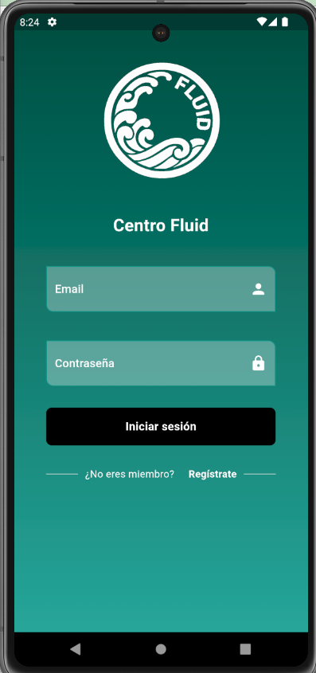
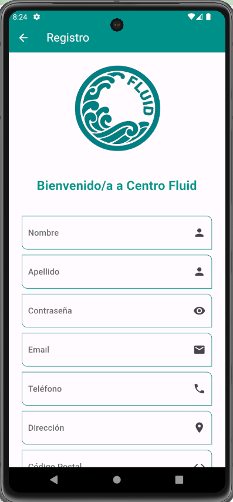

### 🏠 Pantalla principal
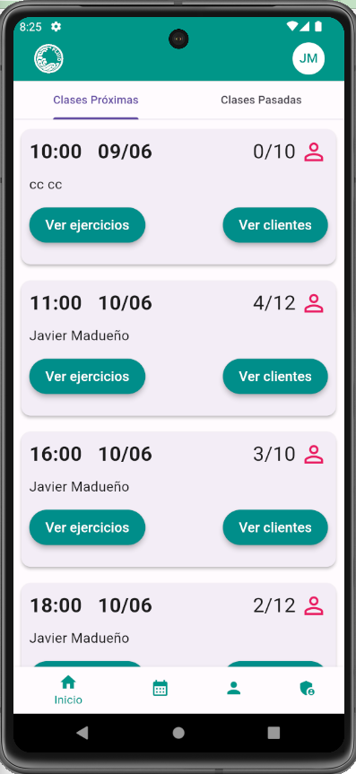

### 📅 Reservas
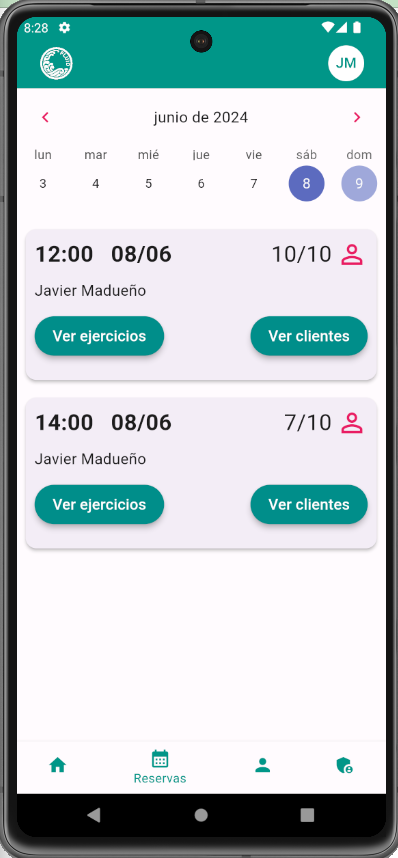

### 👤 Perfil
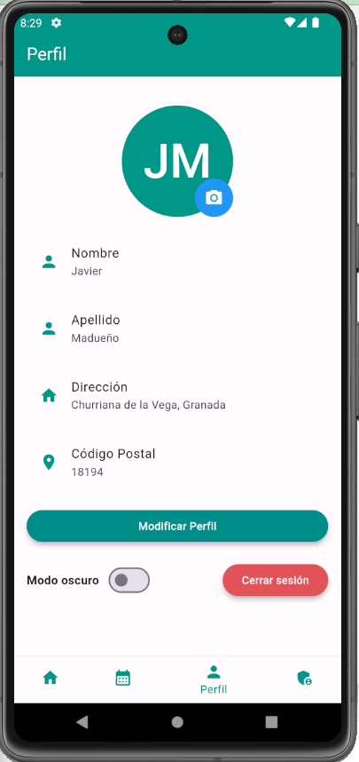
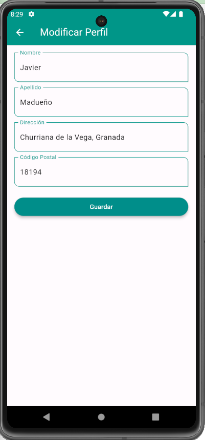

### ⚙️ Panel de administración (Entrenadores)
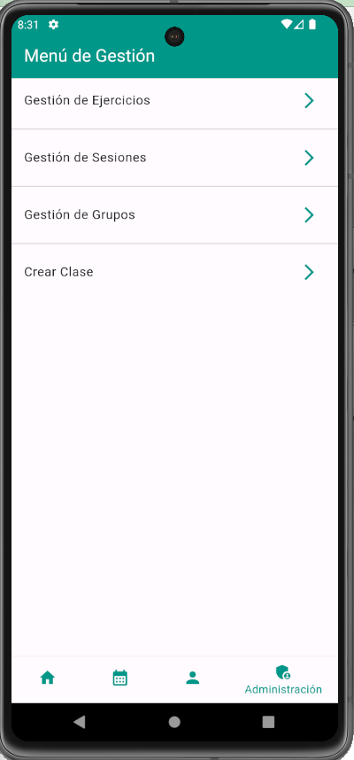
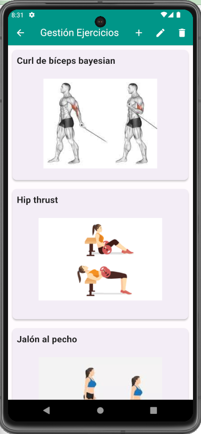
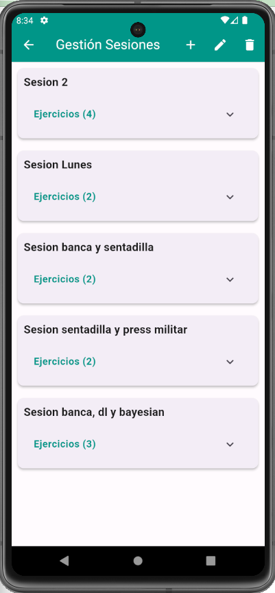
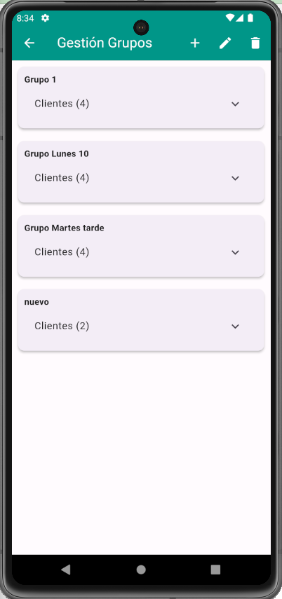
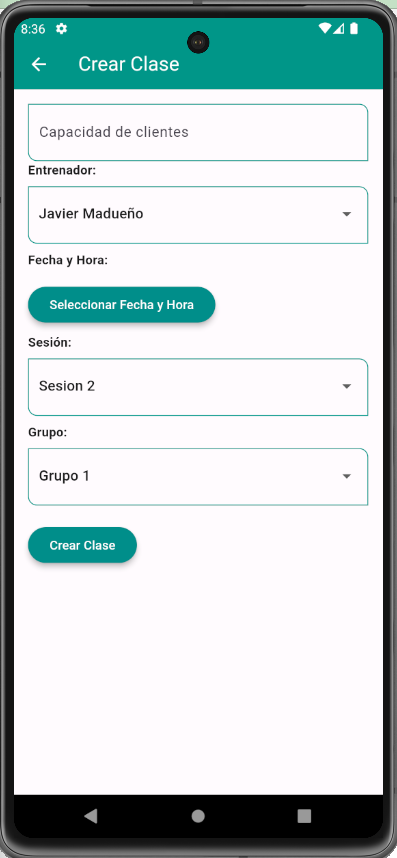

---

## 🎯 Objetivo del proyecto

Desarrollar una solución personalizada que sustituya a aplicaciones comerciales que no se adaptaban a las necesidades del centro, ofreciendo:

- Mayor control sobre la gestión del negocio
- Experiencia de usuario personalizada
- Sistema eficiente y en tiempo real
- Herramienta lista para uso real

---

## 🛠️ Tecnologías utilizadas

### 🚀 Frontend
- **Flutter** → Framework multiplataforma
- **Dart** → Lenguaje de programación

### 🔥 Backend (BaaS)
- **Firebase**
  - Firestore (Base de datos en tiempo real)
  - Authentication (Gestión de usuarios)

### 💻 Entorno de desarrollo
- Visual Studio Code

---

## ⚙️ Características principales

- 🔐 Autenticación de usuarios
- 📅 Sistema de reservas con calendario
- 🔄 Sincronización en tiempo real
- 👥 Gestión de roles (cliente / entrenador)
- 🏋️ Gestión de ejercicios, sesiones y grupos
- 📊 Historial de entrenamientos
- 🌙 Modo oscuro

---

## 🧠 Arquitectura y diseño

- Arquitectura basada en **widgets reutilizables**
- Separación de lógica y UI
- Integración directa con Firebase

### 📊 Modelo de datos (resumen)

- **Usuarios**
  - Clientes
  - Entrenadores (rol)

- **Clases**
  - Asociadas a sesión, entrenador y grupo

- **Grupos**
  - Conjunto de clientes

- **Sesiones**
  - Conjunto de ejercicios

---

## 📈 Resultados

✔ Aplicación completamente funcional  
✔ Gestión en tiempo real  
✔ Interfaz intuitiva  
✔ Adaptada a necesidades reales  

---

## ⚠️ Limitaciones

- Tiempo limitado de desarrollo
- Funcionalidades avanzadas no implementadas
- Complejidad en sincronización en tiempo real

---

## 🚀 Futuras mejoras

- 🔔 Notificaciones push
- 📧 Verificación por email
- 📊 Seguimiento de progreso (pesos)
- 🔐 Persistencia de sesión (auto-login)
